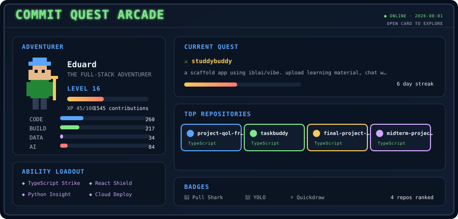

# Hi, I'm Eduard King Anterola

### Computer Science Student · Full-Stack Developer · Aspiring ML Engineer

I build full-stack, mobile, desktop, and AI-powered software with a focus on practical, reliable user experiences.

## About Me

- Studying **Bachelor of Science in Computer Science** at **De La Salle Lipa, Philippines**
- Serving as **Back-End Developer Head** of the AWS Learning Club
- Former **DevOps Head** of DLSL AnimoDev
- Building across full-stack web, mobile, desktop, and AI-assisted applications
- Expanding my skills in **AI engineering, machine learning, data engineering, MLOps, and LLMOps**
- Open to **internships, freelance engagements, entry-level roles, and remote opportunities**

## Tech Stack

**Languages**

**Frontend & Mobile**

**Backend & Databases**

**AI & Data**

**Tools & Deployment**

## Leadership & Current Focus

- As **Back-End Developer Head at AWS Learning Club**, I help design maintainable backend systems, promote cloud-native practices, and mentor student developers.
- As former **DevOps Head at DLSL AnimoDev**, I supported deployment pipelines, infrastructure, and collaborative software projects.
- I am currently deepening my knowledge of **machine learning, statistical analysis, data engineering, Hugging Face, MLOps, and LLMOps** through structured learning and hands-on projects.

## GitHub Analytics

## GitHub Achievements

**Pull Shark · YOLO · Quickdraw**

### Contribution Trophies

## Let's Connect

I am interested in software engineering, full-stack development, mobile development, and AI/ML-focused opportunities.

- Portfolio: [eduard-king.vercel.app](https://eduard-king.vercel.app)
- LinkedIn: [linkedin.com/in/eduard-king-anterola](https://www.linkedin.com/in/eduard-king-anterola/)
- Email: [eduardkinganterola@gmail.com](mailto:eduardkinganterola@gmail.com)
- GitHub: [github.com/Eduard-K-A](https://github.com/Eduard-K-A)

## Commit Quest Arcade

My public GitHub activity powers this retro RPG character sheet and quest map, refreshed daily. Click the card to explore.

