[portfolio](https://eduard-king.vercel.app) &nbsp;·&nbsp;
[linkedin](https://www.linkedin.com/in/eduard-king-anterola/) &nbsp;·&nbsp;
[email](mailto:eduardkinganterola@gmail.com)

> CS student at De La Salle Lipa, in Lipa City, Philippines. 
> Ship it, watch someone use it, then decide what it should have been.

Back-end lead at the AWS Learning Club, DevOps head at AnimoDev before that. Most 
of what I build is full-stack — web, mobile, desktop — and lately I have been 
pulling that toward AI engineering: Python, statistics, Hugging Face, LLMOps. 
Open to internships, freelance work, and entry-level roles.

<samp>typescript &nbsp; python &nbsp; react &nbsp; next.js &nbsp; react native &nbsp; node &nbsp; supabase &nbsp; postgres &nbsp; postgis &nbsp; sqlite &nbsp; electron &nbsp; tailwind &nbsp; git</samp>

**[studdybuddy](https://github.com/Eduard-K-A/studdybuddy)** &nbsp;·&nbsp; <samp>typescript</samp> 
Upload your course material and an agent quizzes you on it. Reading is easy to 
fake; being asked is not.

**[agora](https://github.com/Eduard-K-A/agora)** &nbsp;·&nbsp; <samp>typescript, electron, groq</samp> 
Real-time voice sales assistant that listens to a live call and feeds the rep 
what they need. Top 10 finalist at an Agora-sponsored hackathon.

**[cleanOps](https://github.com/Eduard-K-A/cleanOps)** &nbsp;·&nbsp; <samp>next.js, supabase, postgis</samp> 
Marketplace for home-service work, matched by real geolocation rather than a 
postcode field. Realtime subscriptions, multi-role auth, mock escrow. 
[Mobile client](https://github.com/Eduard-K-A/cleanOps-mobile) in React Native.

**[TaskOverflow](https://github.com/Eduard-K-A/TaskOverflow)** &nbsp;·&nbsp; <samp>electron, sqlite</samp> 
Local-first desktop task manager. Groups, subtasks, deadlines, no account.

Every graphic here is generated, not embedded from anyone else's server. 
`ascii.svg` is a photo pushed through a character ramp by 
[`scripts/make_portrait.py`](scripts/make_portrait.py); the stat graphics and 
these section headings are drawn by [a scheduled action](.github/workflows/stats.yml) 
straight from the GitHub GraphQL API, once a day, committing only what changed.

They animate with SMIL inside the SVG, because GitHub strips scripts from 
READMEs — and since nothing loads from a third party, nothing here can 
rate-limit or go dark. The headings are SVGs for the same reason: GitHub also 
strips CSS, so an image is the only way to put this page's own typeface on them.

The typeface is [JetBrains Mono](scripts/fonts), subset to just the characters 
each graphic draws and inlined as base64. That isn't only for looks: the 
portrait's grid assumes an advance width of exactly 0.600 em, and a viewer whose 
default monospace is narrower would otherwise see it squeezed.

Colours come from CSS custom properties behind a `prefers-color-scheme` query, so 
one file suits both GitHub themes. Density in the portrait has to mean *the 
subject*, not *the bright half of the frame*, so which end of the ramp gets the 
ink is measured off the photo — centre against edges — rather than assumed. Ink 
colour then flips with the theme on its own, and I stay drawn either way.

Language totals cover public, non-fork repositories only. `year.svg` uses the 
portrait's character ramp: `:` `+` `#` `@`, quiet to loud, with the cut-offs set 
at quartiles of my own active days rather than fixed counts.
